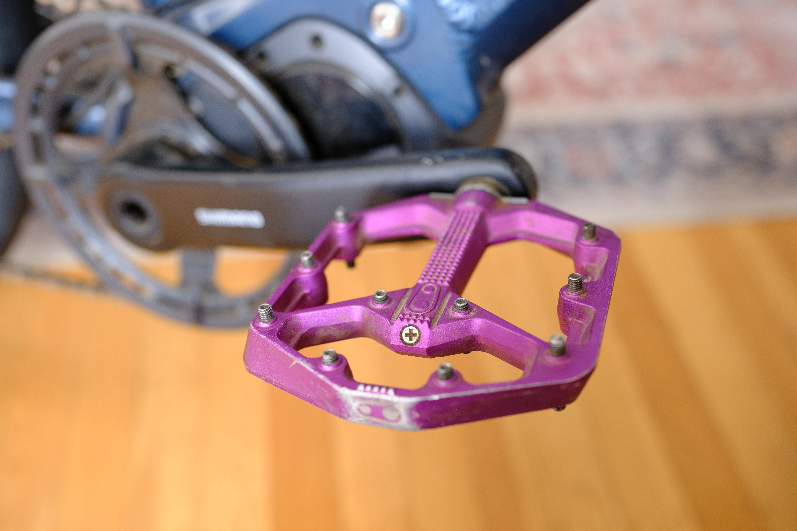
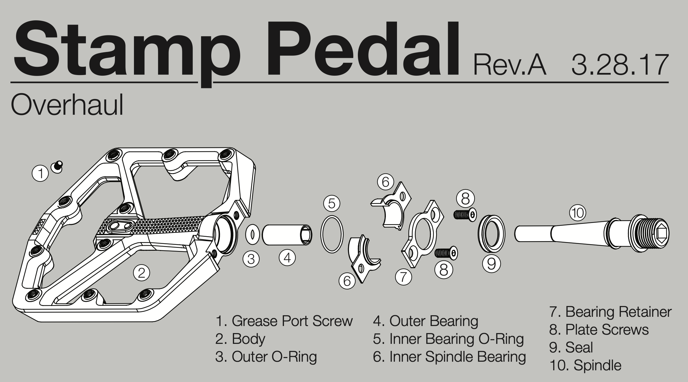

+++
title = 'Crankbrothers Stamp 7 Play'
date = 2023-09-29T17:41:30-07:00
draft = true
+++

I noticed some play in my pedals the other day! I can’t feel anything while riding but you can grab the pedal with your hands and rock the pedal body back and forth around the spindle. They also felt dry to me so I took them apart, cleaned, and re-greased them. That solved some of the problem but there’s still some play.



These Crankbrothers Stamp 7 pedals have [plastic igus bearings](https://web.archive.org/web/20230929223318/https://www.igus.eu/info/plain-bearings-crank-mountain-bike-pedal) in them instead of steel ball bearings. Eventually they wear down as you pedal hundreds of thousands of times. Crankbrothers recommend replacing them with their [refresh kit](https://www.crankbrothers.com/collections/pedal-accessories/products/pedal-refresh-kit-stamp-7-11) every 150-200 hours of riding. I’ve definitely exceeded that and these pedals have nearly 5000 km on them across two bikes. I’m debating whether to replace the bearings yet since I can’t feel anything while riding and I doubt the plastic bearings will wear out the spindle.

Also shout out to Crankbrothers for making it so easy to find documentation on their service intervals and instructions! Here’s a cool excerpt from their [service manual](https://crankbrothers.zendesk.com/hc/en-us/articles/115004284194-Stamp-Technical-Documents) showing the exploded view of this pedal. I might throw the pedal bodies in the ultrasonic cleaner when I do go to overhaul them.
